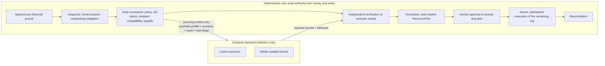

# SikaRescue architecture

> All payment rails, balances, providers, reliabilities and people in this project are
> **synthetic demo data**. No real money moves.

## Authority boundaries



The Pydantic AI agent (Phase 5, below) sits outside this diagram. It can call four scoped
tools and explain the results, but it never owns state, performs financial arithmetic or
chooses routes.

## Why Modal exists

SikaRescue fans each recovery candidate out across **multiple adverse operating regimes**
and evaluates every route × regime independently, in parallel. Modal provides the elastic
execution layer for those synthetic simulations.

Modal is **not** used to make financial-policy decisions. The deterministic application:

1. **filters unsafe routes before compute**: a policy-denied, down, incompatible or
   illiquid route is never sent for simulation;
2. **verifies returned data after compute**: it re-derives hard constraints, fees, route
   identity, scores and ranking locally, checks every shard against what was requested, and
   rejects anything malformed;
3. **creates the plan** (bound to the transaction revision and sealed by a content hash);
4. **owns approval** (a human approves exactly one immutable plan);
5. **executes the payment state machine** (only the outstanding leg, exactly once).

Modal therefore contributes **only synthetic simulation statistics**. A malicious or broken
result cannot make TOKEN_BRIDGE permissible, resurrect MOMO_A, change an amount or fee,
bypass policy, or touch transaction state. The worst a forged-but-consistent result could do
is reorder two routes that were **already** eligible, and a human still approves the plan.

### Workload

| | value |
|---|---|
| routes simulated | only those that passed every hard constraint (SK-10421: MOMO_B, BANK_MOMO_BRIDGE) |
| scenarios | normal, congestion, rail degradation, rail outage, latency spike, correlated failure |
| trials | 50,000 per route × scenario, so 600,000 synthetic recovery outcomes |
| fan-out | route × scenario × 2 trial-range shards = **24 parallel function inputs** |
| resources | CPU only (`cpu=1`, 256 MiB), `max_containers=24`, `scaledown_window=120s` |

Every trial draws from its own counter-based random stream keyed by
`(seed, route_id, scenario, trial_index)`, so changing shard boundaries never changes a
result: success counts are identical to the local backend; latency percentiles agree to
within 0.1 s (different platform maths libraries can differ in the last floating-point digit).

### Measured (Windows laptop client, Modal workspace `pkaysantana`, 2026-09-19)

| path | 600k outcomes |
|---|---|
| local, single process | 5.6 – 7.3 s |
| Modal, warm, long-lived client process | ~2.0 – 2.6 s (remote CPU ~4 s summed across 24 jobs) |
| Modal, warm, fresh CLI process | ~6.8 s (includes ~1.8 s Modal client start + lookup) |
| Modal, cold (fresh deployment, 24 containers) | ~10.3 s |
| raw fan-out only, warm: 1 / 2 / 4 shards | 1.51 / 1.19 / 1.47 s median (12 / 24 / 48 inputs) |

Honest reading: at this size Modal's win is modest and only visible with a warm, long-lived
client (e.g. the API server). For a one-shot CLI process it is **not** faster than local.
The justification is parallel stress analysis and elastic burst capacity that grows with
routes × regimes, not raw latency on a tiny workload. Tiny workloads (the 12,000-trial
`quick` preset) are faster locally: ~0.1 s in-process vs a measured ~0.6–0.8 s warm Modal
round-trip for a near-empty fan-out and ~6.5 s for a cold one.

Cost: `modal billing report --for today` showed about **$0.085** (CPU $0.082 + memory $0.003)
for the whole Phase 4 development session, around 23 stress-sized runs. A single isolated
run is bounded by container idle time (`scaledown_window`), not by the ~4 CPU-seconds of
simulation.

### Fallback: Modal is never a single point of failure

`SIKARESCUE_COMPUTE_BACKEND=modal` builds `FallbackComputeBackend(Modal → Local)` with a
15 s timeout (override: `SIKARESCUE_MODAL_TIMEOUT_SECONDS`). On timeout, authentication/lookup failure, remote exception, unavailability or
a result that fails verification, the local backend evaluates the same request and the
plan's compute summary says so explicitly: `backend=local, fallback_from=modal,
fallback_reason=…`. A `COMPUTE_FALLBACK` audit event is also recorded. The recovery flow then
continues unchanged through approval, payout and reconciliation.

### Commands

```bash
uv run modal deploy -m sikarescue.compute.modal_app       # deploy (CPU-only function)
uv run python scripts/modal_smoke.py                      # LIVE parity + benchmark + tamper demo
SIKARESCUE_COMPUTE_BACKEND=modal uv run python scripts/demo_recovery.py --approve
# PowerShell: $env:SIKARESCUE_COMPUTE_BACKEND="modal"; uv run python scripts/demo_recovery.py --approve
```

App `sikarescue-compute`, function `simulate_shard`. The unit suite never touches the
network; `scripts/modal_smoke.py` is the explicit live integration check.

## Phase 5: Pydantic AI agent, Pydantic AI Gateway, Logfire

**Pydantic AI orchestrates. Pydantic validates schemas. The Gateway controls the model
boundary. Logfire makes execution observable. Modal supplies burst parallel simulation.
Deterministic services retain authority over money.**

### Trust boundaries

```text
USER / operator
 │
 ▼
Pydantic AI RecoveryAgent ── one agent, four scoped tools, structured RecoveryAdvice output
 │   (model traffic)
 ▼
Pydantic AI Gateway ── key management, spend caps, failover routes,
 │                     guardrails (observe / flag / redact / block), request telemetry
 ▼
model provider (built-in or BYOK)


Pydantic AI RecoveryAgent
 │   tools (read / analysis only; every result passes the PII release gate)
 ▼
DETERMINISTIC SIKARESCUE CORE ── diagnosis, hard constraints, verification
 │
 ▼
Modal simulation (local fallback)
 │
 ▼
verified RouteEvaluation ──► immutable, hash-sealed RecoveryPlan
                               │
                               ▼
                         human approval of that exact hash
                               │
                               ▼
                         atomic, idempotent execution of the outstanding leg
                               │
                               ▼
                         reconciliation
```

The model **advises and orchestrates**; the application **decides and executes**.

| The agent may | The agent can never |
|---|---|
| inspect sanitised transaction state (`inspect_incident`) | write the journal or create a financial effect |
| request the deterministic analysis (`evaluate_recovery_options`) | compute a fee, amount or score, or change policy |
| inspect the immutable plan (`inspect_recovery_plan`) | pick an unapproved route or build an executable plan |
| read the sanitised audit timeline (`get_recovery_audit_summary`) | approve, execute or reconcile |

Those four tools are the agent's **entire** reach (`sikarescue/agent/toolbox.py`); there is
no tool through which it could approve, pay or post. Each tool is bound to one transaction
id, returns only an allowlisted DTO (`ModelTransactionView`, `RecoveryDecisionContext`,
`ModelPlanView`, `ModelAuditSummary`) and passes `release_to_model`, which refuses anything
containing recipient PII. `evaluate_recovery_options` runs the same idempotent planning
pipeline as the deterministic path; it moves no money and its plan still needs approval.

### Structured advice, checked against the plan

`RecoveryAdvice` (`models/advice.py`) is the agent's `output_type`. A Pydantic AI output
validator compares every factual field with the deterministic decision packet: plan id,
funds location, recommended route, incremental fee, estimated arrival, simulated
reliability, rejected routes with their exact reasons, and reason codes (which must be a
subset of the codes derived by code). A mismatch raises `ModelRetry` naming the exact
fields; after the output-retry budget the run fails. The advisor re-checks the final advice
against a fresh packet. The advice is **display-only**: approval and execution always use
the plan held by the recovery service, so a model can neither change a fee nor the executed
route.

### Model failure cannot break a recovery

`RecoveryAdvisor` (`agent/advisor.py`) runs the agent under a per-request timeout
(`SIKARESCUE_AGENT_REQUEST_TIMEOUT_SECONDS`, 20 s), a whole-run timeout
(`SIKARESCUE_AGENT_RUN_TIMEOUT_SECONDS`, 60 s) and a request budget. If no provider is
configured, the Gateway or provider errors, the run times out, the output never validates,
or the PII gate refuses a payload, the same plan is explained by deterministic code and
the outcome records `orchestrator = deterministic_fallback` with the reason. Deterministic
planning is shielded from cancellation, so a timeout mid-analysis does not waste the
Modal run: the fallback joins the same planning task. Deterministic errors (for example an
UNKNOWN payout outcome requiring manual review) are propagated, never masked as model
failures. `orchestrator` is one of `pydantic_ai`, `deterministic_fallback` or `deterministic`
(no model requested), and is written to the audit timeline and the trace.

### Gateway

`gateway/<provider>:<model>` strings are resolved with `gateway_provider(...)`, so an
optional `SIKARESCUE_GATEWAY_ROUTE` (a BYOK provider slug or a gateway endpoint with
failover) applies. Credentials come only from the environment (`PYDANTIC_AI_GATEWAY_API_KEY`;
the base URL is inferred from the key's region; the Connect tab's `.../proxy/<route>` form is
also accepted). Verified live on 2026-09-19: `gateway/openai-chat:models/gemini-3.8-flash` on Gateway route `sr`
(Gemini 3.8 Flash behind a custom OpenAI-compatible provider; the response header
`pydantic-ai-gateway-active-provider: sr` confirms the routing).

**Gemini 3 thought signatures.** Gemini 3 returns a `thought_signature` with each tool call
(on the Chat Completions path, in `tool_calls[].extra_content`) and rejects the next request
with HTTP 400 unless it is sent back verbatim. Pydantic AI 2.46's OpenAI Chat model drops that
field, so `agent/model.py` uses `SignaturePreservingChatModel`, a thin subclass that keeps
`extra_content` on the `ToolCallPart` and echoes it. It is a no-op for providers that never
send the field. `backend/tests/test_gateway_model.py` checks the round trip at the HTTP level.

### Recovery decision context (the domain-specific optimisation)

The model does not need the raw transaction history. `RecoveryDecisionContext` is a compact,
evidence-preserving packet: funds location, completed immutable effects, the outstanding
obligation, failure status (definitive or unknown), candidate routes (fee, quoted arrival,
simulated reliability and SLA, p95, stress results), rejected routes with their deterministic
reasons, the compute summary, the selected plan, derived reason codes and the no-replay
invariants. For SK-10421 it is 3,076 bytes against 16,865 bytes for a naive dump of the
same facts (82% smaller).

This is **application-side context design, not a Gateway feature.** The current public
Pydantic documentation (checked 2026-09-19) describes no request-path Gateway
optimisation, so none is claimed. `scripts/gateway_optimization_demo.py` A/B-tests the
packet through the Gateway: same model, task, seeded facts and output schema, with the
provider-reported token usage returned through the Gateway. `--route-b` sends variant B
through a different Gateway route if a route-level optimisation is ever configured.

### Gateway guardrail (defence in depth)

Allowlisted DTOs stay the primary control: the production agent path never sends raw PII.
The Gateway guardrail is an additional boundary, configured per route in Logfire (prebuilt
protections, including phone numbers, plus custom regex; action observe / flag / redact /
block). `scripts/gateway_guardrail_demo.py` deliberately sends the seeded synthetic PII
(Ama Mensah, +233 20 555 0142, GH-9821-SYNTH-0042) to that route, after a PII-free control
request, and classifies strictly by observation: `BLOCKED`, `REDACTED`, `NOT_PROTECTED` or
`INCONCLUSIVE`. Client-side tracing records metadata only for that run.

### Logfire

`telemetry.py` configures Logfire (`send_to_logfire="if-token-present"`), instruments
Pydantic AI (agent run, model request and tool spans), and emits workflow spans and events
under one root span `sikarescue_recovery`:

`incident_received`, `transaction_reconstructed`, `agent_run_started`,
`agent_tool_inspect_incident`, `agent_tool_evaluate_routes`, `modal_compute_started` /
`modal_compute_finished` (or `local_*`), `modal_fallback_used`,
`route_evaluations_verified`, `recovery_plan_created`, `recovery_advice_generated`,
`approval_requested`, `approval_received`, `execution_admitted`, `payout_started`,
`payout_completed`, `recipient_credit_recorded`, `reconciliation_completed`.

Attributes are sanitised scalars only: transaction id, revision, compute backend, parallel
jobs, simulation count, compute time, fallback used, selected route, rejected route count,
plan id and state. There are never names, phone numbers, references or credentials, and
scrubbing patterns are a second line of defence. Every telemetry call is guarded, so a
Logfire failure cannot break a recovery. The trace id is exposed on
`AdvisoryOutcome.trace_id` and printed by the CLI, ready for a future "View trace" link.

### Commands

```bash
uv run python scripts/demo_recovery.py --approve --agent pydantic
# PowerShell: $env:SIKARESCUE_AGENT_MODE="pydantic"; $env:SIKARESCUE_COMPUTE_BACKEND="modal"
uv run python scripts/agent_smoke.py                            # LIVE: agent via Gateway + Logfire
uv run python scripts/gateway_optimization_demo.py --offline    # payload sizes, no model
uv run python scripts/gateway_optimization_demo.py --repeat 3   # LIVE A/B through the Gateway
uv run python scripts/gateway_guardrail_demo.py --route <slug>  # LIVE guardrail check
```

Unit tests use Pydantic AI `FunctionModel` with `ALLOW_MODEL_REQUESTS = False` and Logfire's
`capfire`; they never touch the network. The three scripts above are the live checks, and
each refuses to run, and claims nothing, when its credentials are missing.
