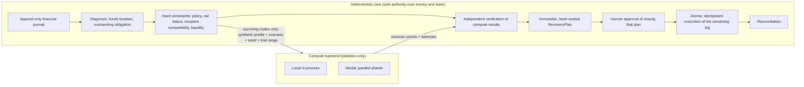

# SikaRescue architecture

> All payment rails, balances, providers, reliabilities and people in this project are
> **synthetic demo data**. No real money moves.

## Authority boundaries



The LLM agent (a later phase) sits outside this diagram. It can call tools and explain the
results, but it never owns state, performs financial arithmetic or chooses routes.

## Why Modal exists

SikaRescue fans each recovery candidate out across **multiple adverse operating regimes**
and evaluates every route × regime independently, in parallel. Modal provides the elastic
execution layer for those synthetic simulations.

Modal is **not** used to make financial-policy decisions. The deterministic application:

1. **filters unsafe routes before compute**: a policy-denied, down, incompatible or
   illiquid route is never sent for simulation;
2. **verifies returned data after compute**: it re-derives hard constraints, fees, route
   identity, scores and ranking locally, checks every shard against what was requested, and
   rejects anything malformed;
3. **creates the plan** (bound to the transaction revision and sealed by a content hash);
4. **owns approval** (a human approves exactly one immutable plan);
5. **executes the payment state machine** (only the outstanding leg, exactly once).

Modal therefore contributes **only synthetic simulation statistics**. A malicious or broken
result cannot make TOKEN_BRIDGE permissible, resurrect MOMO_A, change an amount or fee,
bypass policy, or touch transaction state. The worst a forged-but-consistent result could do
is reorder two routes that were **already** eligible, and a human still approves the plan.

### Workload

| | value |
|---|---|
| routes simulated | only those that passed every hard constraint (SK-10421: MOMO_B, BANK_MOMO_BRIDGE) |
| scenarios | normal, congestion, rail degradation, rail outage, latency spike, correlated failure |
| trials | 50,000 per route × scenario, so 600,000 synthetic recovery outcomes |
| fan-out | route × scenario × 2 trial-range shards = **24 parallel function inputs** |
| resources | CPU only (`cpu=1`, 256 MiB), `max_containers=24`, `scaledown_window=120s` |

Every trial draws from its own counter-based random stream keyed by
`(seed, route_id, scenario, trial_index)`, so changing shard boundaries never changes a
result: success counts are identical to the local backend; latency percentiles agree to
within 0.1 s (different platform maths libraries can differ in the last floating-point digit).

### Measured (Windows laptop client, Modal workspace `pkaysantana`, 2026-09-19)

| path | 600k outcomes |
|---|---|
| local, single process | 5.6 – 7.3 s |
| Modal, warm, long-lived client process | ~2.0 – 2.6 s (remote CPU ~4 s summed across 24 jobs) |
| Modal, warm, fresh CLI process | ~6.8 s (includes ~1.8 s Modal client start + lookup) |
| Modal, cold (fresh deployment, 24 containers) | ~10.3 s |
| raw fan-out only, warm: 1 / 2 / 4 shards | 1.51 / 1.19 / 1.47 s median (12 / 24 / 48 inputs) |

Honest reading: at this size Modal's win is modest and only visible with a warm, long-lived
client (e.g. the API server). For a one-shot CLI process it is **not** faster than local.
The justification is parallel stress analysis and elastic burst capacity that grows with
routes × regimes, not raw latency on a tiny workload. Tiny workloads (the 12,000-trial
`quick` preset) are faster locally: ~0.1 s in-process vs a measured ~0.6–0.8 s warm Modal
round-trip for a near-empty fan-out and ~6.5 s for a cold one.

Cost: `modal billing report --for today` showed about **$0.085** (CPU $0.082 + memory $0.003)
for the whole Phase 4 development session, around 23 stress-sized runs. A single isolated
run is bounded by container idle time (`scaledown_window`), not by the ~4 CPU-seconds of
simulation.

### Fallback: Modal is never a single point of failure

`SIKARESCUE_COMPUTE_BACKEND=modal` builds `FallbackComputeBackend(Modal → Local)` with a
15 s timeout (override: `SIKARESCUE_MODAL_TIMEOUT_SECONDS`). On timeout, authentication/lookup failure, remote exception, unavailability or
a result that fails verification, the local backend evaluates the same request and the
plan's compute summary says so explicitly: `backend=local, fallback_from=modal,
fallback_reason=…`. A `COMPUTE_FALLBACK` audit event is also recorded. The recovery flow then
continues unchanged through approval, payout and reconciliation.

### Commands

```bash
uv run modal deploy -m sikarescue.compute.modal_app       # deploy (CPU-only function)
uv run python scripts/modal_smoke.py                      # LIVE parity + benchmark + tamper demo
SIKARESCUE_COMPUTE_BACKEND=modal uv run python scripts/demo_recovery.py --approve
# PowerShell: $env:SIKARESCUE_COMPUTE_BACKEND="modal"; uv run python scripts/demo_recovery.py --approve
```

App `sikarescue-compute`, function `simulate_shard`. The unit suite never touches the
network; `scripts/modal_smoke.py` is the explicit live integration check.
